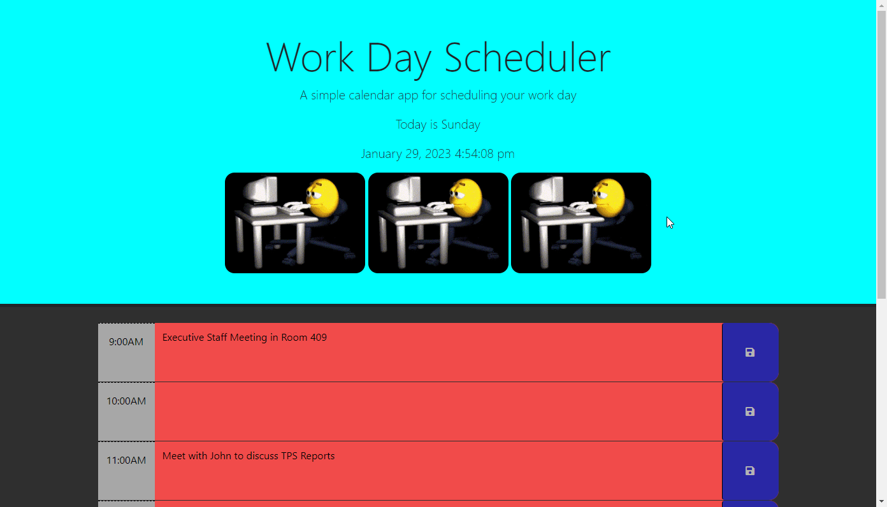

# Workday-Schedule-Planner

This application is a workday scheduler/planner, where you can create a schedule on the current displayed date in the header, and can scehdule events withing the time blocks within standard business hours.

## Aknowledgments

- [How to call a Jquery Library Function](https://www.tutorialspoint.com/How-to-call-a-jQuery-library-function)

- [jQuery parent(), children() and siblings()](http://net-informations.com/jq/iq/parent.htm)

- [Add Class](https://api.jquery.com/addClass/)

- [Remove Class](https://api.jquery.com/removeClass/)

## Author

- [@MacaroniKetchup](https://github.com/MacaroniKetchup)

## Demo

## Deployed Link

- [Workday Schedule Planner](https://macaroniketchup.github.io/workday-schedule-planner/)

## Features

- Allows you to save text in each time-block and retains text saved in time-block upon refreshing the screen.

- Time-blocks change colors based on the current time. (Time blocks change color based on past, present and future-tense)
    - Past Hour blocks are displayed in: Orange (Color Hex: #f1c35e)
    - Current Hour Blocks are displayed in: Red (Color Hex: #f14b4b)
    - Future Hour Blocks are displayed in: Green (Color-Hex: ##77dd77)

## Liscense

MIT License

Copyright (c) 2023 MacaroniKetchup

Permission is hereby granted, free of charge, to any person obtaining a copy
of this software and associated documentation files (the "Software"), to deal
in the Software without restriction, including without limitation the rights
to use, copy, modify, merge, publish, distribute, sublicense, and/or sell
copies of the Software, and to permit persons to whom the Software is
furnished to do so, subject to the following conditions:

The above copyright notice and this permission notice shall be included in all
copies or substantial portions of the Software.

THE SOFTWARE IS PROVIDED "AS IS", WITHOUT WARRANTY OF ANY KIND, EXPRESS OR
IMPLIED, INCLUDING BUT NOT LIMITED TO THE WARRANTIES OF MERCHANTABILITY,
FITNESS FOR A PARTICULAR PURPOSE AND NONINFRINGEMENT. IN NO EVENT SHALL THE
AUTHORS OR COPYRIGHT HOLDERS BE LIABLE FOR ANY CLAIM, DAMAGES OR OTHER
LIABILITY, WHETHER IN AN ACTION OF CONTRACT, TORT OR OTHERWISE, ARISING FROM,
OUT OF OR IN CONNECTION WITH THE SOFTWARE OR THE USE OR OTHER DEALINGS IN THE
SOFTWARE.
